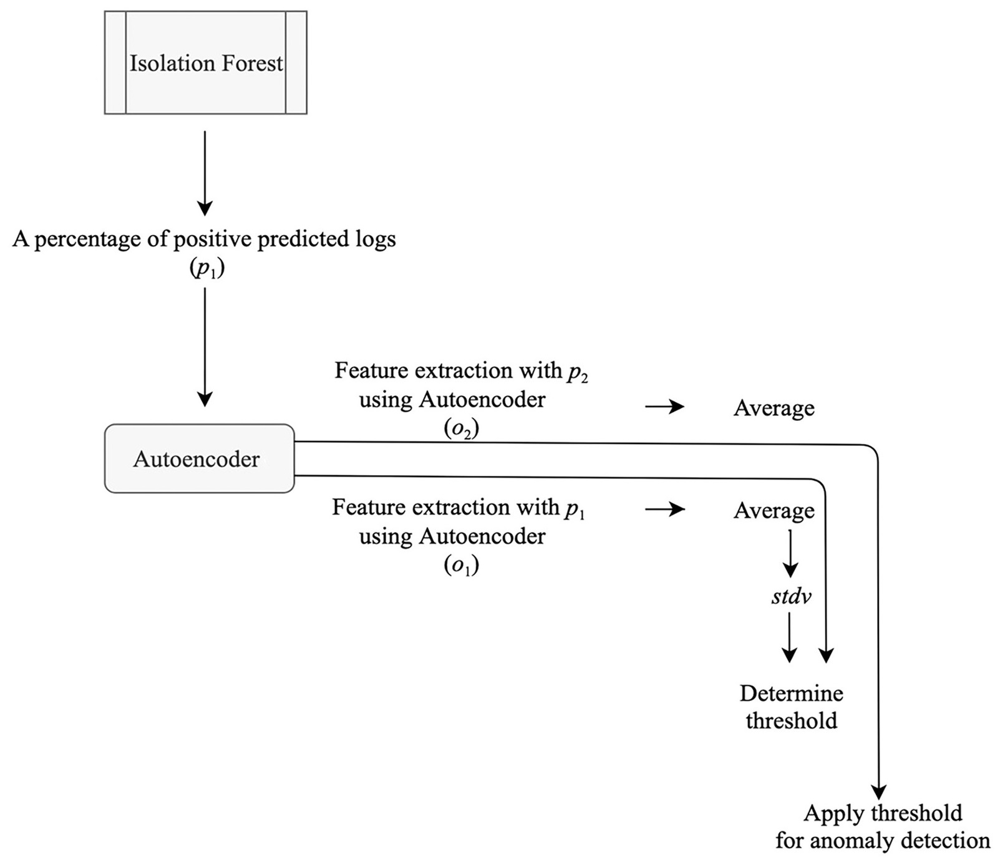
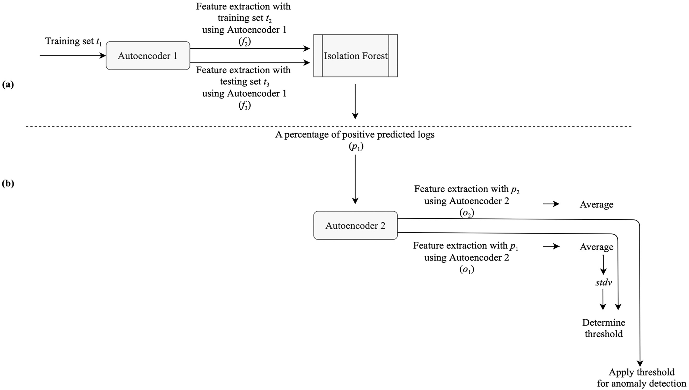

# Log anomaly detection on domain knowledge based deep one classifier with autoencoder

## Introduction

Log Anomaly Detection은 Anomaly Detection 의 한 분야로 서버의 기록된 log 데이터에서 특이 상황을 감지한다. 실시간으로 수많은 기록이 지나가는 로그 특정 상, 수 많은 기록 중 확인이 필요한 범위를 축소해주는 Log Anomaly Detection은 서버 관리자의 시간과 노력을 아낄수 있을 것으로 기대 된다.

사용 된 Unsupervised log message anomaly detection 의 경우 paper 를 읽고 제작하여 원본 코드와 다를 수 있다.

## Running on Your Own Machine

Keras==2.4.3 , tensorflow==2.4.0 기반

```
$ pip install -r requirements.txt
```

```
$ python compare.py
```


## Model

### NN_Autoencoder_Architecture


### LSTM_Autoencoder_Architecture


### Isolation Forest + Autoencoder


### Isolation Forest + Two Autoencoder
Unsupervised log message anomaly detection


## Reference

* Autoencoder : https://github.com/zpettry/AI-Autoencoder-for-HTTP-Log-Anomaly-Detection
* HTTP Data : https://www.kaggle.com/shawon10/web-log-dataset#webLog.csv
* Deeplog : https://github.com/nailo2c/deeplog
* Amir Farzad, T. Aaron Gulliver, [Unsupervised log message anomaly detection](https://www.sciencedirect.com/science/article/pii/S2405959520300643), ICT Express, Volume 6, Issue 3, 2020.
* [**ICSE'19**] Jieming Zhu, Shilin He, Jinyang Liu, Pinjia He, Qi Xie, Zibin Zheng, Michael R. Lyu. [Tools and Benchmarks for Automated Log Parsing](https://arxiv.org/pdf/1811.03509.pdf). *International Conference on Software Engineering (ICSE)*, 2019.
   * github : https://github.com/logpai/logparser
* [**DSN'16**] Pinjia He, Jieming Zhu, Shilin He, Jian Li, Michael R. Lyu. [An Evaluation Study on Log Parsing and Its Use in Log Mining](https://jiemingzhu.github.io/pub/pjhe_dsn2016.pdf). *IEEE/IFIP International Conference on Dependable Systems and Networks (DSN)*, 2016.
  * github : https://github.com/logpai/logparser
* Shilin He, Jieming Zhu, Pinjia He, Michael R. Lyu. [Experience Report: System Log Analysis for Anomaly Detection](https://jiemingzhu.github.io/pub/slhe_issre2016.pdf), *IEEE International Symposium on Software Reliability Engineering (ISSRE)*, 2016. [[Bibtex](https://dblp.org/rec/bibtex/conf/issre/HeZHL16)][[中文版本](https://github.com/AmateurEvents/article/issues/2)]
  * github : https://github.com/logpai/loglizer
* Shilin He, Jieming Zhu, Pinjia He, Michael R. Lyu. [Loghub: A Large Collection of System Log Datasets towards Automated Log Analytics](https://arxiv.org/abs/2008.06448). *Arxiv*, 2020. 
  * github : https://github.com/logpai/loghub