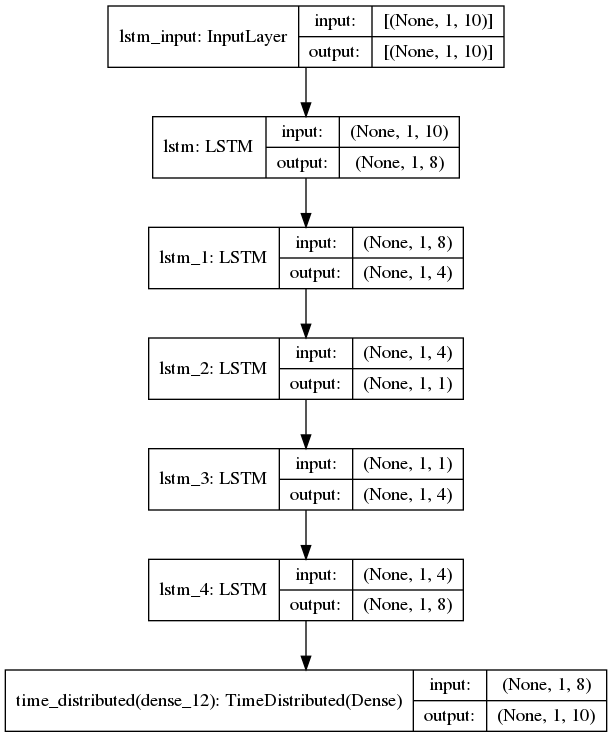

# Log Anomaly Detection

## Introduction

Log Anomaly Detection은 Anomaly Detection 의 한 분야로 서버의 기록된 log 데이터에서 특이 상황을 감지한다. 실시간으로 수많은 기록이 지나가는 로그 특정 상, 수 많은 기록 중 확인이 필요한 범위를 축소해주는 Log Anomaly Detection은 서버 관리자의 시간과 노력을 아낄수 있을 것으로 기대 된다.

## Running on Your Own Machine

Keras==2.4.3 , tensorflow==2.4.0 기반

```
$ pip install -r requirements.txt
```

```
$ python compare.py
```


## Model

### NN_Autoencoder_Architecture


### LSTM_Autoencoder_Architecture


### Isolation Forest + Autoencoder


### Isolation Forest + Two Autoencoder

## Reference

* Autoencoder : https://github.com/zpettry/AI-Autoencoder-for-HTTP-Log-Anomaly-Detection
* HTTP Data : https://www.kaggle.com/shawon10/web-log-dataset#webLog.csv
* HDFS Data & Lenma preprocess : https://github.com/logpai/loglizer 
* Deeplog : https://github.com/nailo2c/deeplog
* Unsupervised log message anomaly detection : https://www.sciencedirect.com/science/article/pii/S2405959520300643